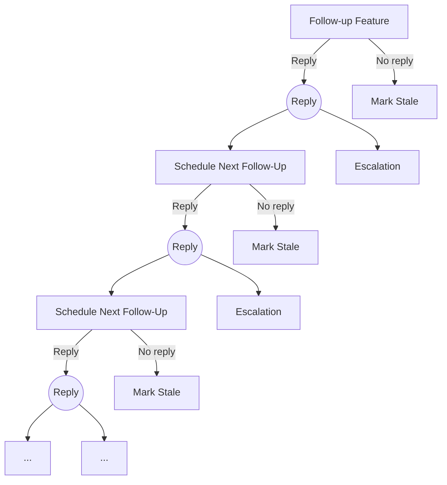

# Yaplate - A Multilingual Bridge Between Contributors and Maintainers

Yaplate is a GitHub App bot that helps maintainers and contributors communicate better by translating, summarizing, and generating replies inside GitHub issues and pull requests.

---

## What Yaplate Does:
Yaplate works directly inside GitHub issues and pull requests.

### Features:
- Translate issue and pull request comments into your preferred language
- Summarize long issue threads so maintainers can catch up quickly
- Generate reply drafts using AI when asked
- Auto deletes its own comments
- Send follow-up reminders for assigned issues and pull requests (optional)
- Mark inactive threads as stale (optional)

---

## How to Use:

Mention the bot in an issue or pull request comment.

For translation and reply commands, quote the comment you want the bot to respond to. Yaplate will translate or generate a reply based on the quoted text.
* **Website: [Yaplate Website](https://ashutoshdebug.github.io/yaplatebot)**
* **Test here: [Yaplate Test](https://github.com/ashutoshdebug/yaplate-test.git)**

---

## Commands:

### Summarize a thread:
For default english
```text
@yaplate summarize
```
### Summarize in specific language:
```text
@yaplate summarize in <language_code>
```
### Translate a comment:
Quote the message and run:
```text
@yaplate translate to <language_code>
```
### Ask for reply draft:
Quote the message and run:
```text
@yaplate reply in <language_code>
<your_reply_text>
```

## Real Example
**User:**
```text
> Estoy bloqueado por un error de dependencias…

@yaplate translate to en
```
**Yaplate:**
```text
> Estoy bloqueado por un error de dependencias…

Translation (en):

“I’m blocked by a dependency error…”
```

---
## Automated Features:
* **Greet the author/assignee**: Yaplate will greet the author or assignee when they open their first issue or pull request in the repository.
* **Follow-Up Scheduler:** Yaplate will ask for follow-ups from the author/assignee after a delay. If no response is received, the issue/PR may be marked as stale.
* **Auto-delete bot comment:** If you delete the comment that triggered Yaplate, the bot will also delete its corresponding reply (the one created because of your comment).

## Follow-up Reminders:
If enabled, Yaplate automatically schedules follow-ups when:

* An issue is assigned to someone
* A PR is opened (optional)

It sends reminders after a delay if no progress is detected.

Follow-ups are posted in the assignee/author language when possible.

### How it works:
* A follow-up timer starts when an issue is assigned or a pull request is opened.
* Yaplate detects the language of the issue/PR and uses that language for follow-up messages.
* If the assignee/author replies to the follow-up with a quoted response, Yaplate treats it as progress and schedules the next follow-up (if configured).
* If there is no meaningful progress after the configured number of follow-ups, Yaplate posts a stale comment explaining the inactivity.
* **Special Case:** if the user indicates they are blocked or waiting for maintainer approval, Yaplate stops escalation and posts a message requesting maintainer attention. No further follow-ups or stale marking will occur.




## Language Codes:
Yaplate uses standard language codes (ISO 639-1). Examples:
| Code | Language |
|------|----------|
| `en` | English |
| `hi` | Hindi |
| `fr` | French |
| `ja` | Japanese|
| `zh` | Chinese |

## Powered By:
* Lingo.dev API (translation)
* FastAPI (Webhook server)
* Redis (state + scheduling)
* Gemini API (summarization + semantic checks + Human intention)

## Self Hosting (Railway):
### Step-I: Deploy:
  - Create a Railway project
  - Deploy this repo from GitHub
  - Add a Redis database in the same Railway project
  - Generate a public domain in Railway (Networking → Generate Domain)

### Step-II Required Environment Variables:
|Variable | Required |	Description |
|---------|----------|--------------|
| GITHUB_WEBHOOK_SECRET |	Yes	| Webhook signature secret |
| GITHUB_APP_ID |	Yes	| GitHub App ID |
| GITHUB_PRIVATE_KEY |	Yes	| Full PEM private key content |
| REDIS_URL |	Yes	| Redis connection URL |
| LINGO_API_KEY |	Yes	| Translation API key |
| GEMINI_API_KEY |	Yes |	Gemini API key |

**Note:** Do NOT use GITHUB_PRIVATE_KEY_PATH on Railway. Use GITHUB_PRIVATE_KEY.

---

## GitHub App Setup:

1. Create a GitHub App from GitHub Developer Settings

2. Enable webhook events:
  * Issues
  * Issue comments
  * Pull requests
  * Pull request review comments
  * Installation
  * Installation repositories
3. Set webhook URL:
```text
https://YOUR_DOMAIN/webhook
```
4. Generate and download the private key .pem

## GitHub App Permissions and Events:

Yaplate requires the following GitHub App permissions to work correctly:
  * Repository Permissions
  * Issues: Read & write
  * Pull requests: Read & write
  * Metadata: Read-only
  * Contents: Read-only (optional, only if future repo config is enabled)

---

## Running Locally:
1. Install dependencies:
```python
pip install -r requirements.txt
```
2. Setup environment:
* Create a .env file:
```env
GITHUB_WEBHOOK_SECRET=...
GITHUB_APP_ID=...
GITHUB_PRIVATE_KEY_PATH=github_private_key.pem
LINGO_API_KEY=...
GEMINI_API_KEY=...
REDIS_URL=redis://localhost:6379/0
```
3. Start Redis:
```python
docker run -p 6379:6379 redis
```
4. Run the bot
```python
uvicorn app.main:app --host 0.0.0.0 --port 8000

```
5. Expose webhook
```python
ngrok http 8000
```
6. Then set Github App Webhook URL to:
```text
https://<ngrok-domain>/webhook
```

## Upcoming features:
1. Better handling of language drift across long issues and pull requests
2. Per-repository and per-organization configuration
3. Disable bot for selected issues and pull requests
4. Cached responses when LLM or translation services are unavailable
5. Better permission minimization

## Screenshots of Yaplate's comments:
1. **Translate:**
   

2. **Reply:**
   

3. **Follow-ups and Stale labelling:**
   
   
4. **Greet:**
   

5. **Maintainers mentioned by Yaplate:**
   

## Support:
For bugs, feature requests, or feedback:
* Open an issue in this repository
* Or contact: [ashutoshkumart82@gmail.com](mailto:ashutoshkumart82@gmail.com)
